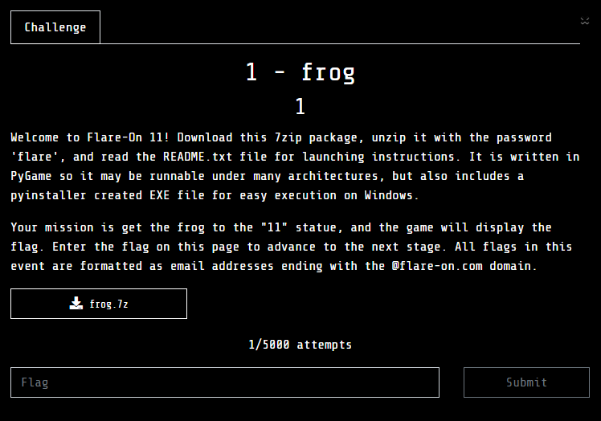
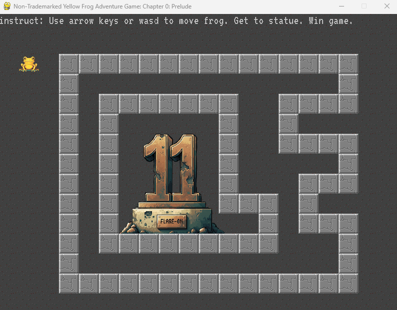
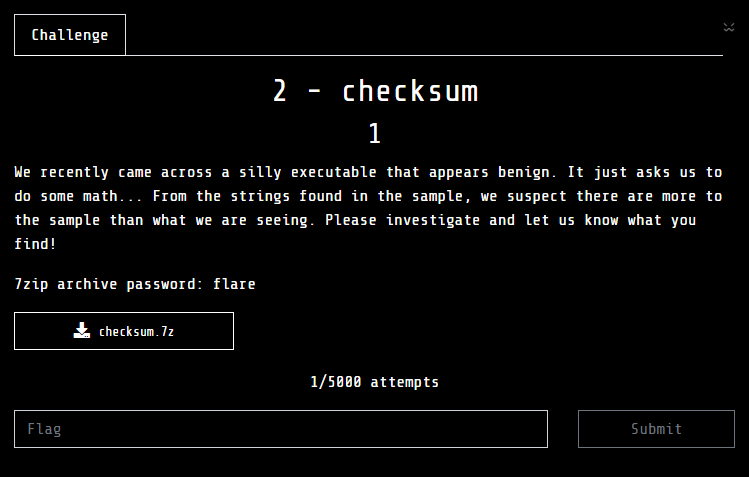
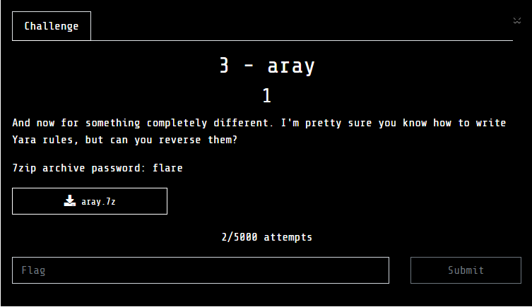
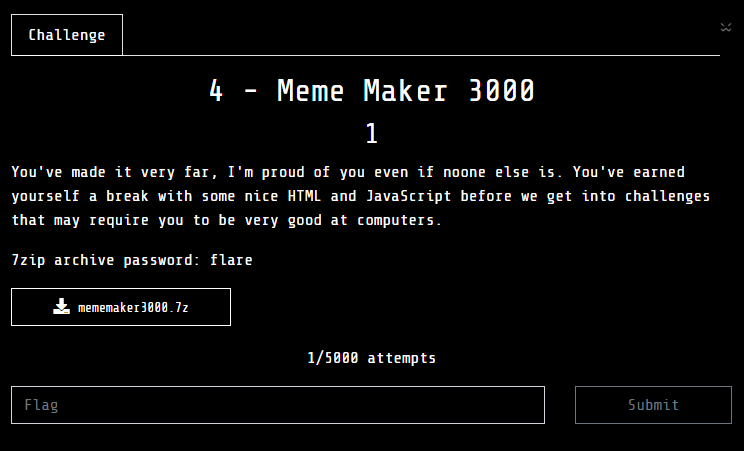
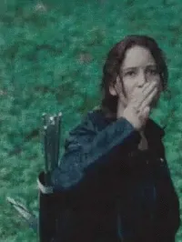


Every year, the flare-on offers reverse engineering enthusiasts a unique set of puzzles that push our skills and creativity to new limits. 


This year it was no different. I’ll be writing down a short blog about my experience tackling this years challenges.

## Timeline



Starting of Flare-on



Solved Challenge 1 - frog



Solved Challenge 2 - checksum



Solved Challenge 3 - aray



Solved Challenge 4 - Meme Maker 3000



Ending of Flare-on




## Challenge 1 - frog

We were given a game written in python using the pygames library. 

The logic of the game and the encryption was simple to understand and didn't take me much to get the flag.

## Challenge 2 - checksum

For me this was the most chellenging one out of all the challenges I solved.
We had to reverse an executable written in [Go](https://go.dev/).

The first step was to reverse engineer the hash used to solve the checksum, and the second step involved 
finding the path where the flag image was generated.

## Challenge 3 - aray

We had to deal with [yara](https://virustotal.github.io/yara/) rule constraints into solving the challenge through patience and scripting. At the end of solving, my script turned out to be of 407 lines.

## Challenge 4 - Meme Maker 3000

Last of the challenge that I managed to solve was Meme Maker 300 which was a Javascript Obfuscattion challenge.

I quickly deobfuscated and clened up the code as I began to understand the logic. After playing with the browser counsole
couple to times, I managed to understand the logic for the required conditions and got the flag.

## Goodbye

That wraps up my journey, having solved 4 out of 10 challenges. 

I might have solved more if I had been consistent but I’m happy with my performance this year improving over my last years results. Along the way, I got the chance to learn and explore new techniques growing as a reverse engineer.

So, this is a seeya and not a goodbye. Will come back stronger and better next year.

:)

